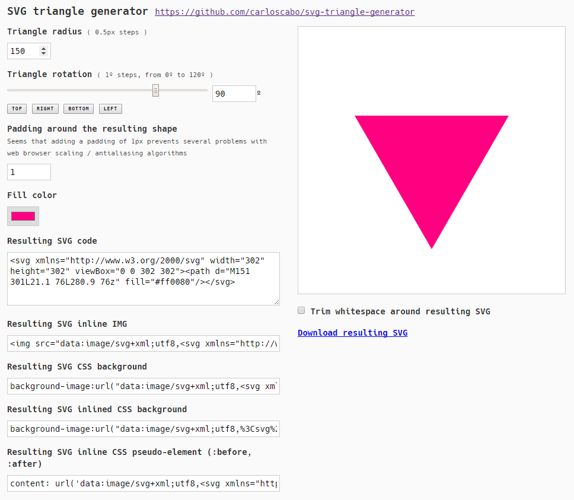

# svg-triangle-generator
Simple demo of generating an equilateral triangle in SVG using JS.

**[View the working demo](http://htmlpreview.github.io/?https://github.com/carloscabo/svg-triangle-generator/blob/master/index.html)**

